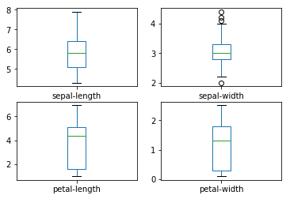
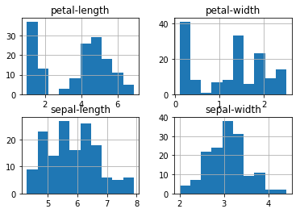
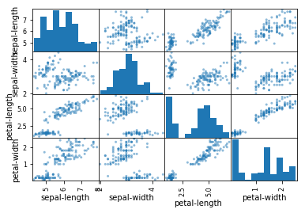
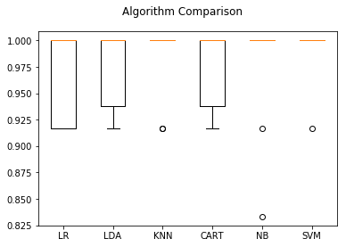

```python
# Load libraries
import pandas
from pandas.plotting import scatter_matrix
import matplotlib.pyplot as plt
from sklearn import model_selection
from sklearn.metrics import classification_report
from sklearn.metrics import confusion_matrix
from sklearn.metrics import accuracy_score
from sklearn.linear_model import LogisticRegression
from sklearn.tree import DecisionTreeClassifier
from sklearn.neighbors import KNeighborsClassifier
from sklearn.discriminant_analysis import LinearDiscriminantAnalysis
from sklearn.naive_bayes import GaussianNB
from sklearn.svm import SVC
```


```python
# Load dataset
url = "teste.data"
names = ['sepal-length', 'sepal-width', 'petal-length', 'petal-width', 'class']
dataset = pandas.read_csv(url, names=names)
```


```python
dataset
```


<div>
<style scoped>
    .dataframe tbody tr th:only-of-type {
        vertical-align: middle;
    }

    .dataframe tbody tr th {
        vertical-align: top;
    }

    .dataframe thead th {
        text-align: right;
    }
</style>
<table border="1" class="dataframe">
  <thead>
    <tr style="text-align: right;">
      <th></th>
      <th>sepal-length</th>
      <th>sepal-width</th>
      <th>petal-length</th>
      <th>petal-width</th>
      <th>class</th>
    </tr>
  </thead>
  <tbody>
    <tr>
      <th>0</th>
      <td>5.1</td>
      <td>3.5</td>
      <td>1.4</td>
      <td>0.2</td>
      <td>Iris-setosa</td>
    </tr>
    <tr>
      <th>1</th>
      <td>4.9</td>
      <td>3.0</td>
      <td>1.4</td>
      <td>0.2</td>
      <td>Iris-setosa</td>
    </tr>
    <tr>
      <th>2</th>
      <td>4.7</td>
      <td>3.2</td>
      <td>1.3</td>
      <td>0.2</td>
      <td>Iris-setosa</td>
    </tr>
    <tr>
      <th>3</th>
      <td>4.6</td>
      <td>3.1</td>
      <td>1.5</td>
      <td>0.2</td>
      <td>Iris-setosa</td>
    </tr>
    <tr>
      <th>4</th>
      <td>5.0</td>
      <td>3.6</td>
      <td>1.4</td>
      <td>0.2</td>
      <td>Iris-setosa</td>
    </tr>
    <tr>
      <th>5</th>
      <td>5.4</td>
      <td>3.9</td>
      <td>1.7</td>
      <td>0.4</td>
      <td>Iris-setosa</td>
    </tr>
    <tr>
      <th>6</th>
      <td>4.6</td>
      <td>3.4</td>
      <td>1.4</td>
      <td>0.3</td>
      <td>Iris-setosa</td>
    </tr>
    <tr>
      <th>7</th>
      <td>5.0</td>
      <td>3.4</td>
      <td>1.5</td>
      <td>0.2</td>
      <td>Iris-setosa</td>
    </tr>
    <tr>
      <th>8</th>
      <td>4.4</td>
      <td>2.9</td>
      <td>1.4</td>
      <td>0.2</td>
      <td>Iris-setosa</td>
    </tr>
    <tr>
      <th>9</th>
      <td>4.9</td>
      <td>3.1</td>
      <td>1.5</td>
      <td>0.1</td>
      <td>Iris-setosa</td>
    </tr>
    <tr>
      <th>10</th>
      <td>5.4</td>
      <td>3.7</td>
      <td>1.5</td>
      <td>0.2</td>
      <td>Iris-setosa</td>
    </tr>
    <tr>
      <th>11</th>
      <td>4.8</td>
      <td>3.4</td>
      <td>1.6</td>
      <td>0.2</td>
      <td>Iris-setosa</td>
    </tr>
    <tr>
      <th>12</th>
      <td>4.8</td>
      <td>3.0</td>
      <td>1.4</td>
      <td>0.1</td>
      <td>Iris-setosa</td>
    </tr>
    <tr>
      <th>13</th>
      <td>4.3</td>
      <td>3.0</td>
      <td>1.1</td>
      <td>0.1</td>
      <td>Iris-setosa</td>
    </tr>
    <tr>
      <th>14</th>
      <td>5.8</td>
      <td>4.0</td>
      <td>1.2</td>
      <td>0.2</td>
      <td>Iris-setosa</td>
    </tr>
    <tr>
      <th>15</th>
      <td>5.7</td>
      <td>4.4</td>
      <td>1.5</td>
      <td>0.4</td>
      <td>Iris-setosa</td>
    </tr>
    <tr>
      <th>16</th>
      <td>5.4</td>
      <td>3.9</td>
      <td>1.3</td>
      <td>0.4</td>
      <td>Iris-setosa</td>
    </tr>
    <tr>
      <th>17</th>
      <td>5.1</td>
      <td>3.5</td>
      <td>1.4</td>
      <td>0.3</td>
      <td>Iris-setosa</td>
    </tr>
    <tr>
      <th>18</th>
      <td>5.7</td>
      <td>3.8</td>
      <td>1.7</td>
      <td>0.3</td>
      <td>Iris-setosa</td>
    </tr>
    <tr>
      <th>19</th>
      <td>5.1</td>
      <td>3.8</td>
      <td>1.5</td>
      <td>0.3</td>
      <td>Iris-setosa</td>
    </tr>
    <tr>
      <th>20</th>
      <td>5.4</td>
      <td>3.4</td>
      <td>1.7</td>
      <td>0.2</td>
      <td>Iris-setosa</td>
    </tr>
    <tr>
      <th>21</th>
      <td>5.1</td>
      <td>3.7</td>
      <td>1.5</td>
      <td>0.4</td>
      <td>Iris-setosa</td>
    </tr>
    <tr>
      <th>22</th>
      <td>4.6</td>
      <td>3.6</td>
      <td>1.0</td>
      <td>0.2</td>
      <td>Iris-setosa</td>
    </tr>
    <tr>
      <th>23</th>
      <td>5.1</td>
      <td>3.3</td>
      <td>1.7</td>
      <td>0.5</td>
      <td>Iris-setosa</td>
    </tr>
    <tr>
      <th>24</th>
      <td>4.8</td>
      <td>3.4</td>
      <td>1.9</td>
      <td>0.2</td>
      <td>Iris-setosa</td>
    </tr>
    <tr>
      <th>25</th>
      <td>5.0</td>
      <td>3.0</td>
      <td>1.6</td>
      <td>0.2</td>
      <td>Iris-setosa</td>
    </tr>
    <tr>
      <th>26</th>
      <td>5.0</td>
      <td>3.4</td>
      <td>1.6</td>
      <td>0.4</td>
      <td>Iris-setosa</td>
    </tr>
    <tr>
      <th>27</th>
      <td>5.2</td>
      <td>3.5</td>
      <td>1.5</td>
      <td>0.2</td>
      <td>Iris-setosa</td>
    </tr>
    <tr>
      <th>28</th>
      <td>5.2</td>
      <td>3.4</td>
      <td>1.4</td>
      <td>0.2</td>
      <td>Iris-setosa</td>
    </tr>
    <tr>
      <th>29</th>
      <td>4.7</td>
      <td>3.2</td>
      <td>1.6</td>
      <td>0.2</td>
      <td>Iris-setosa</td>
    </tr>
    <tr>
      <th>...</th>
      <td>...</td>
      <td>...</td>
      <td>...</td>
      <td>...</td>
      <td>...</td>
    </tr>
    <tr>
      <th>120</th>
      <td>6.9</td>
      <td>3.2</td>
      <td>5.7</td>
      <td>2.3</td>
      <td>Iris-virginica</td>
    </tr>
    <tr>
      <th>121</th>
      <td>5.6</td>
      <td>2.8</td>
      <td>4.9</td>
      <td>2.0</td>
      <td>Iris-virginica</td>
    </tr>
    <tr>
      <th>122</th>
      <td>7.7</td>
      <td>2.8</td>
      <td>6.7</td>
      <td>2.0</td>
      <td>Iris-virginica</td>
    </tr>
    <tr>
      <th>123</th>
      <td>6.3</td>
      <td>2.7</td>
      <td>4.9</td>
      <td>1.8</td>
      <td>Iris-virginica</td>
    </tr>
    <tr>
      <th>124</th>
      <td>6.7</td>
      <td>3.3</td>
      <td>5.7</td>
      <td>2.1</td>
      <td>Iris-virginica</td>
    </tr>
    <tr>
      <th>125</th>
      <td>7.2</td>
      <td>3.2</td>
      <td>6.0</td>
      <td>1.8</td>
      <td>Iris-virginica</td>
    </tr>
    <tr>
      <th>126</th>
      <td>6.2</td>
      <td>2.8</td>
      <td>4.8</td>
      <td>1.8</td>
      <td>Iris-virginica</td>
    </tr>
    <tr>
      <th>127</th>
      <td>6.1</td>
      <td>3.0</td>
      <td>4.9</td>
      <td>1.8</td>
      <td>Iris-virginica</td>
    </tr>
    <tr>
      <th>128</th>
      <td>6.4</td>
      <td>2.8</td>
      <td>5.6</td>
      <td>2.1</td>
      <td>Iris-virginica</td>
    </tr>
    <tr>
      <th>129</th>
      <td>7.2</td>
      <td>3.0</td>
      <td>5.8</td>
      <td>1.6</td>
      <td>Iris-virginica</td>
    </tr>
    <tr>
      <th>130</th>
      <td>7.4</td>
      <td>2.8</td>
      <td>6.1</td>
      <td>1.9</td>
      <td>Iris-virginica</td>
    </tr>
    <tr>
      <th>131</th>
      <td>7.9</td>
      <td>3.8</td>
      <td>6.4</td>
      <td>2.0</td>
      <td>Iris-virginica</td>
    </tr>
    <tr>
      <th>132</th>
      <td>6.4</td>
      <td>2.8</td>
      <td>5.6</td>
      <td>2.2</td>
      <td>Iris-virginica</td>
    </tr>
    <tr>
      <th>133</th>
      <td>6.3</td>
      <td>2.8</td>
      <td>5.1</td>
      <td>1.5</td>
      <td>Iris-virginica</td>
    </tr>
    <tr>
      <th>134</th>
      <td>6.1</td>
      <td>2.6</td>
      <td>5.6</td>
      <td>1.4</td>
      <td>Iris-virginica</td>
    </tr>
    <tr>
      <th>135</th>
      <td>7.7</td>
      <td>3.0</td>
      <td>6.1</td>
      <td>2.3</td>
      <td>Iris-virginica</td>
    </tr>
    <tr>
      <th>136</th>
      <td>6.3</td>
      <td>3.4</td>
      <td>5.6</td>
      <td>2.4</td>
      <td>Iris-virginica</td>
    </tr>
    <tr>
      <th>137</th>
      <td>6.4</td>
      <td>3.1</td>
      <td>5.5</td>
      <td>1.8</td>
      <td>Iris-virginica</td>
    </tr>
    <tr>
      <th>138</th>
      <td>6.0</td>
      <td>3.0</td>
      <td>4.8</td>
      <td>1.8</td>
      <td>Iris-virginica</td>
    </tr>
    <tr>
      <th>139</th>
      <td>6.9</td>
      <td>3.1</td>
      <td>5.4</td>
      <td>2.1</td>
      <td>Iris-virginica</td>
    </tr>
    <tr>
      <th>140</th>
      <td>6.7</td>
      <td>3.1</td>
      <td>5.6</td>
      <td>2.4</td>
      <td>Iris-virginica</td>
    </tr>
    <tr>
      <th>141</th>
      <td>6.9</td>
      <td>3.1</td>
      <td>5.1</td>
      <td>2.3</td>
      <td>Iris-virginica</td>
    </tr>
    <tr>
      <th>142</th>
      <td>5.8</td>
      <td>2.7</td>
      <td>5.1</td>
      <td>1.9</td>
      <td>Iris-virginica</td>
    </tr>
    <tr>
      <th>143</th>
      <td>6.8</td>
      <td>3.2</td>
      <td>5.9</td>
      <td>2.3</td>
      <td>Iris-virginica</td>
    </tr>
    <tr>
      <th>144</th>
      <td>6.7</td>
      <td>3.3</td>
      <td>5.7</td>
      <td>2.5</td>
      <td>Iris-virginica</td>
    </tr>
    <tr>
      <th>145</th>
      <td>6.7</td>
      <td>3.0</td>
      <td>5.2</td>
      <td>2.3</td>
      <td>Iris-virginica</td>
    </tr>
    <tr>
      <th>146</th>
      <td>6.3</td>
      <td>2.5</td>
      <td>5.0</td>
      <td>1.9</td>
      <td>Iris-virginica</td>
    </tr>
    <tr>
      <th>147</th>
      <td>6.5</td>
      <td>3.0</td>
      <td>5.2</td>
      <td>2.0</td>
      <td>Iris-virginica</td>
    </tr>
    <tr>
      <th>148</th>
      <td>6.2</td>
      <td>3.4</td>
      <td>5.4</td>
      <td>2.3</td>
      <td>Iris-virginica</td>
    </tr>
    <tr>
      <th>149</th>
      <td>5.9</td>
      <td>3.0</td>
      <td>5.1</td>
      <td>1.8</td>
      <td>Iris-virginica</td>
    </tr>
  </tbody>
</table>
<p>150 rows × 5 columns</p>
</div>


```python
# shape
print(dataset.shape)
```

    (150, 5)


```python
# get header
print(dataset.head(20))
```

        sepal-length  sepal-width  petal-length  petal-width        class
    0            5.1          3.5           1.4          0.2  Iris-setosa
    1            4.9          3.0           1.4          0.2  Iris-setosa
    2            4.7          3.2           1.3          0.2  Iris-setosa
    3            4.6          3.1           1.5          0.2  Iris-setosa
    4            5.0          3.6           1.4          0.2  Iris-setosa
    5            5.4          3.9           1.7          0.4  Iris-setosa
    6            4.6          3.4           1.4          0.3  Iris-setosa
    7            5.0          3.4           1.5          0.2  Iris-setosa
    8            4.4          2.9           1.4          0.2  Iris-setosa
    9            4.9          3.1           1.5          0.1  Iris-setosa
    10           5.4          3.7           1.5          0.2  Iris-setosa
    11           4.8          3.4           1.6          0.2  Iris-setosa
    12           4.8          3.0           1.4          0.1  Iris-setosa
    13           4.3          3.0           1.1          0.1  Iris-setosa
    14           5.8          4.0           1.2          0.2  Iris-setosa
    15           5.7          4.4           1.5          0.4  Iris-setosa
    16           5.4          3.9           1.3          0.4  Iris-setosa
    17           5.1          3.5           1.4          0.3  Iris-setosa
    18           5.7          3.8           1.7          0.3  Iris-setosa
    19           5.1          3.8           1.5          0.3  Iris-setosa


```python
print(dataset.describe())
```

           sepal-length  sepal-width  petal-length  petal-width
    count    150.000000   150.000000    150.000000   150.000000
    mean       5.843333     3.054000      3.758667     1.198667
    std        0.828066     0.433594      1.764420     0.763161
    min        4.300000     2.000000      1.000000     0.100000
    25%        5.100000     2.800000      1.600000     0.300000
    50%        5.800000     3.000000      4.350000     1.300000
    75%        6.400000     3.300000      5.100000     1.800000
    max        7.900000     4.400000      6.900000     2.500000


```python
# class

print(dataset.groupby('class').size())
```

    class
    Iris-setosa        50
    Iris-versicolor    50
    Iris-virginica     50
    dtype: int64


```python
# box and whisker plots
dataset.plot(kind='box', subplots=True, layout=(2,2), sharex=False, sharey=False)
plt.show()
```





```python
print(dataset.hist())
plt.show()
```

    [[<matplotlib.axes._subplots.AxesSubplot object at 0x1a2376da58>
      <matplotlib.axes._subplots.AxesSubplot object at 0x1a23be02b0>]
     [<matplotlib.axes._subplots.AxesSubplot object at 0x1a23c8fcf8>
      <matplotlib.axes._subplots.AxesSubplot object at 0x1a1a789390>]]





```python
scatter_matrix(dataset)
plt.show()
```





```python
# Split-out validation dataset
array = dataset.values
X = array[:,0:4]
Y = array[:,4]
validation_size = 0.20
seed = 7
X_train, X_validation, Y_train, Y_validation = model_selection.train_test_split(X, Y, test_size=validation_size, random_state=seed)
```


```python
# Test options and evaluation metric
seed = 7
scoring = 'accuracy'
```


```python
# Spot Check Algorithms
models = []
models.append(('LR', LogisticRegression()))
models.append(('LDA', LinearDiscriminantAnalysis()))
models.append(('KNN', KNeighborsClassifier()))
models.append(('CART', DecisionTreeClassifier()))
models.append(('NB', GaussianNB()))
models.append(('SVM', SVC()))
# evaluate each model in turn
results = []
names = []
for name, model in models:
	kfold = model_selection.KFold(n_splits=10, random_state=seed)
	cv_results = model_selection.cross_val_score(model, X_train, Y_train, cv=kfold, scoring=scoring)
	results.append(cv_results)
	names.append(name)
	msg = "%s: %f (%f)" % (name, cv_results.mean(), cv_results.std())
	print(msg)
```

    LR: 0.966667 (0.040825)
    LDA: 0.975000 (0.038188)
    KNN: 0.983333 (0.033333)
    CART: 0.975000 (0.038188)
    NB: 0.975000 (0.053359)
    SVM: 0.991667 (0.025000)


```python
# Compare Algorithms
fig = plt.figure()
fig.suptitle('Algorithm Comparison')
ax = fig.add_subplot(111)
plt.boxplot(results)
ax.set_xticklabels(names)
plt.show()
```





```python
# Make predictions on validation dataset
knn = KNeighborsClassifier()
knn.fit(X_train, Y_train)
predictions = knn.predict(X_validation)
print(accuracy_score(Y_validation, predictions))
print(confusion_matrix(Y_validation, predictions))
print(classification_report(Y_validation, predictions))
```

    0.9
    [[ 7  0  0]
     [ 0 11  1]
     [ 0  2  9]]
                     precision    recall  f1-score   support
    
        Iris-setosa       1.00      1.00      1.00         7
    Iris-versicolor       0.85      0.92      0.88        12
     Iris-virginica       0.90      0.82      0.86        11
    
        avg / total       0.90      0.90      0.90        30
    


```python
knn.predict([ [3.5,1.3,4.1,4.6]] )
```
